<!--
  ───────────────────────────────────────────
  HinohArata — GitHub Profile
  Keep it clean. Keep it moving.
  ───────────────────────────────────────────
-->

  
    
  

 

  <samp>
    Self-taught developer from Indonesia, mostly living inside AOSP, kernels, and the
    idea that you can build real software fully on a phone.
  </samp>

  

## &nbsp;▍ 01 · now building

  <table>
    <tr>
      <td align="center" width="33%"><b>Apex Studio</b> Android IDE for Android — an Android Studio alternative
       
      
      </td>
      <td align="center" width="33%"><b>Poco X3 NFC (surya)</b> Device maintainer — sm6150 · everything device
       
      
      </td>
      <td align="center" width="33%"><b>AfterlifeOS</b> AOSP custom ROM — maintainer + OTA
       
      
      </td>
    </tr>
  </table>

 

## &nbsp;▍ 02 · craft

**android**
`Java` `Kotlin` `XML` `Gradle` `ADB`

**aosp · kernel**
`C` `C++` `Shell` `Makefile` `KernelSU` `TWRP` `Git` `Linux`

**web · tooling**
`JavaScript` `TypeScript` `React` `Next.js` `Node.js` `Express` `MongoDB` `Python`

 

## &nbsp;▍ 03 · data & analytics

  
  
   
  

 

## &nbsp;▍ 04 · key repos

  <table>
    <tr>
      <td align="center" width="50%">
        
      </td>
      <td align="center" width="50%">
        
      </td>
    </tr>
    <tr>
      <td align="center" width="50%">
        
      </td>
      <td align="center" width="50%">
        
      </td>
    </tr>
  </table>

 

## &nbsp;▍ 05 · find me

  
  
  

 

  

  crafted with <code>&lt;/&gt;</code> and coffee · from Indonesia

